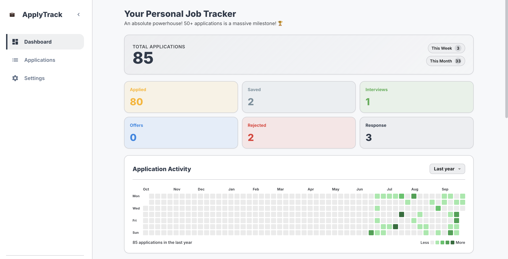
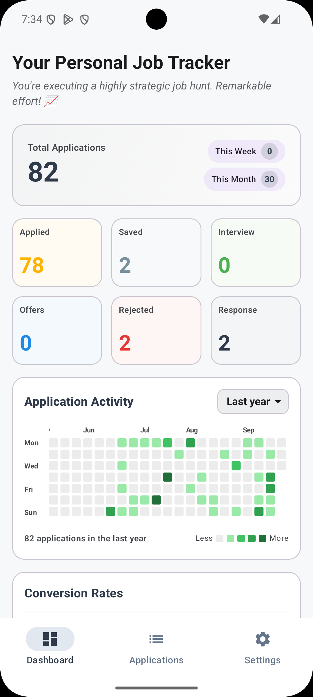
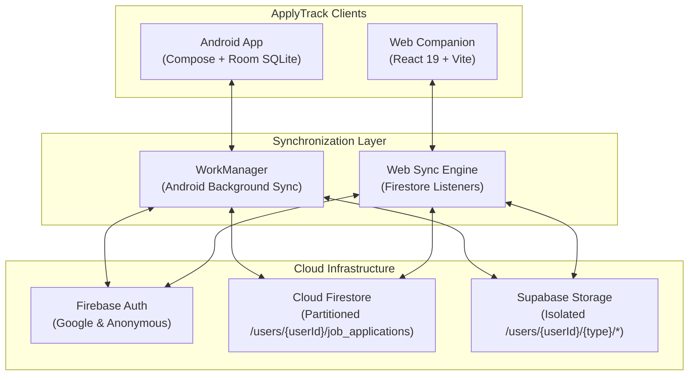

# ApplyTrack 🚀

<div align="center">

  

  <h3>Modern, Offline-First Job Application &amp; Career Tracker</h3>
  <p>Track your opportunities effortlessly across native Android and modern Web companion with real-time cloud synchronization.</p>

  [](https://github.com/mudasirunar/ApplyTrack/actions/workflows/ci.yml)
  [](LICENSE)
  [](CONTRIBUTING.md)
  <br />
  [](https://kotlinlang.org/)
  [](https://developer.android.com/jetpack/compose)
  [](https://developer.android.com/jetpack/androidx/releases/room)
  [](https://react.dev/)
  [](https://vite.dev/)
  [](https://firebase.google.com/)
  [](https://supabase.com/)

</div>

---

## 📖 Overview

**ApplyTrack** is an open-source, privacy-first career management platform engineered for job seekers who want a lightning-fast, zero-friction way to record and track applications. 

Unlike traditional spreadsheet trackers or ad-heavy platforms, ApplyTrack adopts a **local-first philosophy**:
* **Immediate Responsiveness:** Capture jobs with zero latency, even completely offline.
* **Dual-Client Synchronization:** Seamlessly sync your pipeline between your **Android device** on the go and your **Web browser** on your desktop.
* **Dual-Cloud Architecture:** Structured job metadata is synchronized via **Cloud Firestore**, while physical binary attachments (resumes, cover letters, and offer PDFs) are preserved in **Supabase Storage**.
* **Zero Lock-in:** 100% data ownership with instant one-click ZIP backup and complete GDPR data erasure.

---

## 📸 Visual Showcase

| Web Companion (Desktop & Tablet) | Android App (Jetpack Compose) |
| :---: | :---: |
|  |  |
| *Desktop Kanban &amp; Application Manager* | *Native Android Material 3 Interface* |

> *Tip: Additional high-resolution preview shots and demo captures are available in [`docs/screenshots/`](docs/screenshots/).*

---

## ✨ Features at a Glance

| Capability | Android App | Web Companion | Notes |
| :--- | :---: | :---: | :--- |
| **Offline-First Storage** | ✅ (Room SQLite) | ✅ (Browser Cache) | Instant UI responsiveness with background sync |
| **Status Pipeline** | ✅ | ✅ | Saved, Applied, Interview, Offer, Rejected |
| **Timeline & History** | ✅ | ✅ | Track status changes and interview milestones |
| **Attachment Handling** | ✅ | ✅ | Resumes, Cover Letters, Portfolios &amp; Screenshots |
| **Document Preview** | ✅ (Native PDF/Image) | ✅ (In-browser viewer) | View attached PDFs directly inside the app |
| **Career Analytics** | ✅ | ✅ | Response rate, platform breakdown, resume performance |
| **Google Authentication** | ✅ | ✅ | Secure, credential-free Google sign-in |
| **Guest / Anonymous Mode**| ✅ | ✅ | Try the app instantly without an account |
| **Full Data Export (ZIP)** | ✅ | ✅ | Export full JSON database + original binary documents |

---

## 🏗️ Architecture & Data Flow

ApplyTrack splits metadata and binary assets to keep sync fast, lightweight, and cost-effective:



---

## 📂 Repository Structure

```
ApplyTrack/
├── AndroidApp/
│   └── ApplyTrack/             # Native Android project (Kotlin, Compose, Room, Gradle)
├── WebApp/                     # Web companion application (React 19, Vite, Vanilla CSS)
├── docs/
│   └── screenshots/            # App screenshots, graphics, and architectural assets
├── .github/
│   ├── ISSUE_TEMPLATE/         # Bug report & feature request forms
│   ├── PULL_REQUEST_TEMPLATE.md# Pre-merge checklist for contributors
│   └── workflows/ci.yml        # Path-filtered automated Continuous Integration
├── CONTRIBUTING.md             # Developer onboarding and contributing guidelines
├── CODE_OF_CONDUCT.md         # Contributor Covenant Code of Conduct
├── SECURITY.md                 # Responsible vulnerability disclosure policy
└── LICENSE                     # MIT Open Source License
```

---

## 🚀 Quickstart & Setup Guide

### 1. Web App Setup

1. **Navigate to the web directory:**
   ```bash
   cd WebApp
   ```
2. **Install dependencies:**
   ```bash
   npm install
   ```
3. **Configure environment variables:**
   ```bash
   cp .env.example .env.local
   ```
   *Fill in your Firebase and Supabase credentials in `.env.local`.*
4. **Start the development server:**
   ```bash
   npm run dev
   ```
   Open [http://localhost:5173](http://localhost:5173) in your browser.

---

### 2. Android App Setup

1. **Open project in Android Studio:**
   Select **Open** and choose `ApplyTrack/AndroidApp/ApplyTrack`.
2. **Configure local properties:**
   ```bash
   cd AndroidApp/ApplyTrack
   cp local.properties.example local.properties
   ```
3. **Set up Firebase configuration:**
   ```bash
   cp app/google-services.json.example app/google-services.json
   ```
   *(For full authentication testing, download your project's `google-services.json` from the Firebase Console).*
4. **Build and Run:**
   - Launch via Android Studio or run unit tests from the terminal:
   ```bash
   ./gradlew testDebugUnitTest
   ```

---

### 3. Cloud Backend Setup (Optional for Local Offline Testing)

The app works immediately in **offline/guest mode** with the provided example files. If you wish to connect your own cloud accounts for multi-device sync:
1. **Firebase Authentication:** In your Firebase Console under **Build ➔ Authentication ➔ Sign-in method**, enable both **Google** and **Anonymous** providers.
2. **Cloud Firestore Rules:** Apply the security rules from [`firestore.rules`](firestore.rules) in your Firebase Console under **Firestore Database ➔ Rules**.
3. **Supabase Storage Bucket & Policies:** Open your Supabase project's **SQL Editor** and run the SQL migration script in [`supabase/storage_rules.sql`](supabase/storage_rules.sql) to automatically provision the `ApplyTrack` storage bucket and user-scoped permissions.

---

## 🧪 Automated Testing & CI

Continuous Integration is powered by **GitHub Actions** (`.github/workflows/ci.yml`). Pull Requests trigger path-specific validation:
* **Web changes (`WebApp/**`):** Runs `npm run lint`, `npm test` (Vitest), and `npm run build`.
* **Android changes (`AndroidApp/**`):** Executes `./gradlew testDebugUnitTest` (70 automated tests).

Run tests locally before submitting your contribution:
```bash
# Test Web
cd WebApp && npm run lint && npm test && npm run build

# Test Android
cd AndroidApp/ApplyTrack && ./gradlew testDebugUnitTest
```

---

## 🔒 Privacy & Security

ApplyTrack is designed with privacy as a foundational principle:
* **100% Free & Open Source:** No ads, no commercial trackers, and no selling of user resumes or application history.
* **Per-User Security Isolation:** Firestore and Supabase rules enforce strict account partitioning.
* **Zero Lock-In:** Export or wipe all your data at any time from the Settings screen.
* Read the complete [Privacy Policy](WebApp/src/pages/Privacy.jsx) or visit the deployed app's `/privacy` page.

For security vulnerabilities, please refer to our [Security Policy](SECURITY.md).

---

## 🤝 Contributing

We welcome issues, feature suggestions, and pull requests! Please read our [Contributing Guide](CONTRIBUTING.md) to get started.

All participants are expected to adhere to our [Code of Conduct](CODE_OF_CONDUCT.md).

---

## 📄 License

This project is licensed under the [MIT License](LICENSE) - feel free to use, modify, and distribute according to the terms of the license.

---

<div align="center">
  Crafted with ❤️ by <a href="https://github.com/mudasirunar">Mudasir Ali</a>
</div>
